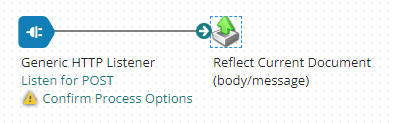
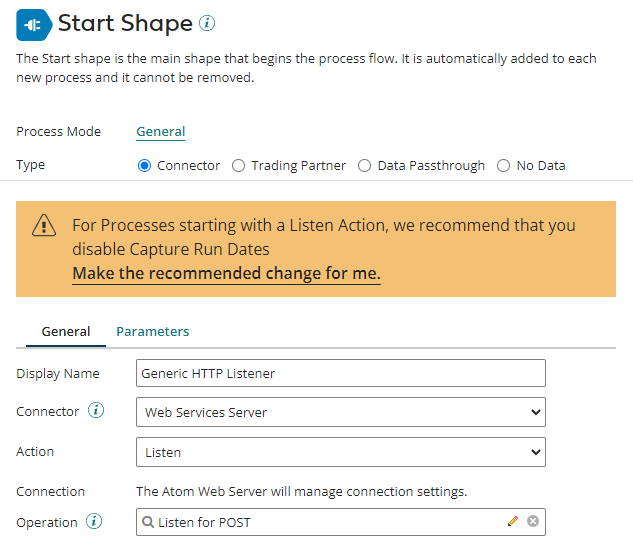
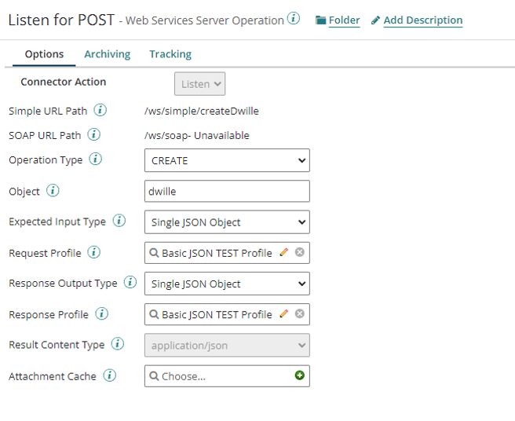
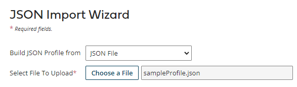
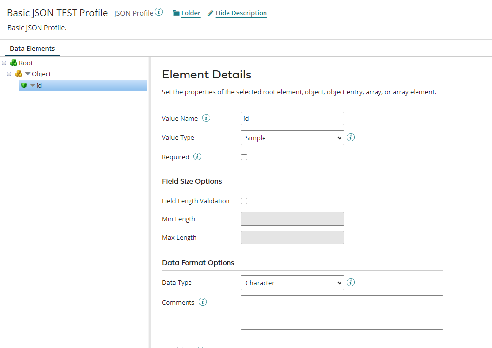
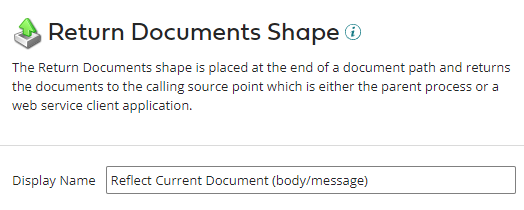
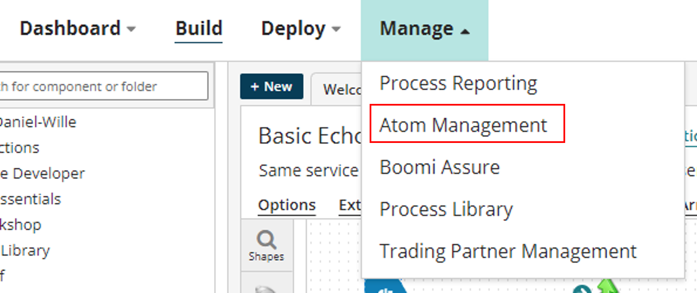
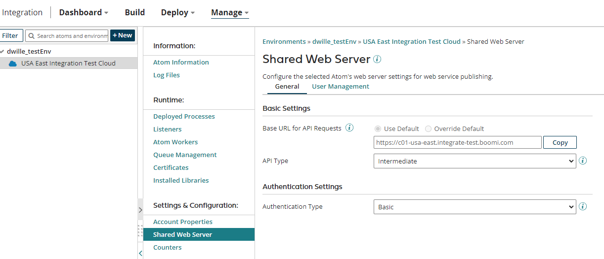
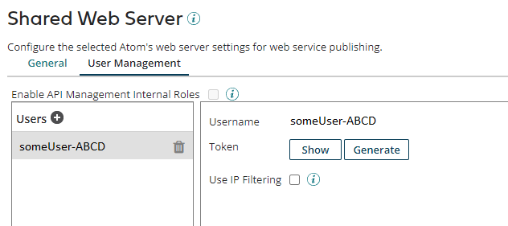
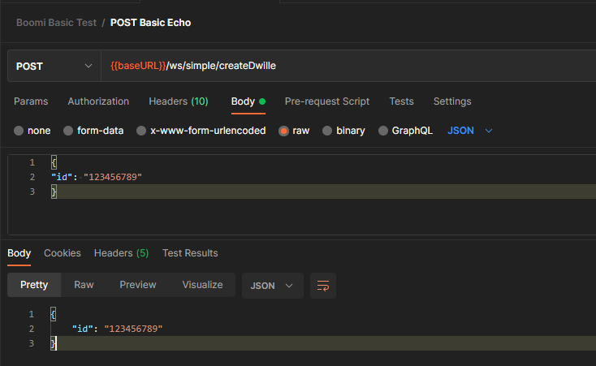

# Echo Service Lab

This document will walk you step-by-step through building out your echo service. 

## Expected Outcome
By the end of this lab, you should have a Web Service Listener to which you can POST the provided sample payload and have it echoed back to the requesting client. Note: If you wish to work with different request payloads, you will need to modify your JSON Profile accordingly, which is not covered in this lab.

## Process Overview

This is a very basic Process with only two shapes:

- ***Start Shape***: This defines your Listener (Protocol, Operation, Profile)
- ***Reflect Current Document***: This will return your Document (payload/message body) back to the requesting client.

Your final Process will look similar to this:



## Prerequisites

- Download the [Sample JSON Profile](../samples/sampleProfile.json "Sample JSON Profile")
- Download the [Sample Request](../test/sampleRequest.json "Sample Request")

## Build the Start Shape

1. Create a new Process in your directory of choice.
2. Modify the Process name at the top of the tab as desired (eg Basic Echo).
3. Modify your Start Shape as follows, completing the Web Service (WS) Operation step in the section below as required:
	* ***Type***: Connector
	* ***Display Name***: Any alias you desire, eg. Generic HTTP Listener
	* ***Connector***: Web Services Server
	* ***Action***: Listen
	* ***Operation***: Click the '+' to [Build the Web Services Server Listen Operation](#build-the-web-services-server-listen-operation)
4. Click OK to finish the Start Shape. Save.

Once complete, it should look similar to the following:



## Build the Web Services Server Listen Operation

After being redirected to the New Web Services Server Connector Operation dialog, complete the following steps:

1. Modify your Operation name at the top of the tab as desired (eg Listen for POST).
2. Modify the Options as follows, completing the JSON Profile step in the section below as required:
	* ***Simple URL Path***: This will be automatically updated as you modify the rest of the options. You will want to capture this value for later use.
	* ***Operation Type***: CREATE (this will listen for a POST with a payload we can reflect)
	* ***Object***: Whatever you desire. For my test I used 'dwille'. This will be used in defining your resource path.
	* ***Expected Input Type***: Single JSON Object (we will use a very basic JSON Payload for this lab).
	* ***Request Profile***: Click the '+' to [Build the JSON Profile](#build-the-json-profile)
	* ***Response Output Type***: Single JSON Object (as we are simply reflecting the request payload)
	* ***Response Profile***: Select the same JSON Profile you build for the Request Profile as we are simply reflecting the request payload.
3. Click Save and Close. This should take you back to the Process interface to finish the [Build the Start Shape](#build-the-start-shape) step above.

Once complete, it should look similar to the following:



Ensure you capture:

- Simple URL Path (eg /ws/simple/createDwille)

## Build the JSON Profile

After being redirected to the New JSON Profile dialog, complete the following steps:

1. Modify your Operation name at the top of the tab as desired (eg Basic JSON TEST Profile).
2. Click either the "Import a Profile" or "Import" button. Select JSON File and chooe the [Sample JSON Profile](../samples/sampleProfile.json "Sample JSON Profile") you downloaded in the [Prerequisites](#prerequisites) section. The Import interface should look similar to the below image. Click Next, Finish.



3. Save and Close. This should take you back to the to the interface to complete the [Web Services Server Listen Operation](#build-the-web-services-server-listen-operation) step.

Your finished JSON Profile should look similar to the following:



## Buildout the Process

Now that we have created our Web Service Listener and Profile, we need to return the request payload back to the requesting client.

1. Drag the Return Documents Shape onto the Process Canvas.
2. Change the Display Name as desired and click OK.



3. Connect the Start Shape to the Return Documents Shape.
4. Save.

Your Process should now look similar to the image shown:


## Package and Deploy the Process

To test the Process, we must package and deploy it to an Atom. As this process will vary based on your configuration and environment, exact steps are not provided and instead the assumption of this knowledge is tracked in the [Prerequisites](../README.md#prerequisites) section.

1. Click Create Packaged Component in the top right hand corner of the Process canvas interface.
2. Deploy the Packaged Component

## Configure the Webserver

The setup provided here will be for a minimal viable solution. More advanced authentication, API Management, etc. methods could be used to extend this as desired.
***Note:*** Changing these settings could modify the behavior of other deployments in your environment. This lab is done assuming a fresh setup.

1. Navigate to Manage --> Atom Management, and select the environment you deployed to on the left hand navigation pane.



2. Navigate to the Settings & Configuration --> Shared Web Server. Configure this as follows:
	* ***Base URL***: You will want to capture this value for later use. (eg https://c01-usa-east.integrate-test.boomi.com)
	* ***API Type***: Intermediate. This will allow us to control our Auth method here rather than in the APIM configuration and call the WS directly.
	* ***Authentication Type***: Basic
3. Save the setup. Once complete, it should look similar to the following:



4. In the same interface, navigate to the User Management tab (upper, middle of interface). Ensure you have a user here and generate a token if you have not done so already. You will want to capture the Username and Token (password) for authenticating to the Web Service.



Ensure you capture:

- Base URL (eg. https://c01-usa-east.integrate-test.boomi.come)
- Username
- Token (password)

## Test your Process

Now that you have deployed and configured your Web Service, you can proceed to test it out using the provided [Sample Request](../test/sampleRequest.json "Sample Request"). Here is an example setup in Postman with the Authorization section set to Basic Auth with the Username and Token configured:



Alternatively something like CURL could be used for testing instead, similar to either of the examples shown below:

```
curl --location --request POST 'https://c01-usa-east.integrate-test.boomi.com/ws/simple/createDwille' \
--header 'Authorization: Basic someBase64Value' \
--header 'Content-Type: application/json' \
--data-raw '{
"id": "123456789"
}'
```

```
curl -X 'POST' \
  'https://c01-usa-east.integrate-test.boomi.com/ws/simple/createDwille' \
  -u 'someUsername':'somePassword' \
  -H 'accept: application/json' \
  -H 'Content-Type: application/json' \
  -d '{
  "id": "123456789"
}'
```

## Conclusion

Congratulations! At this point you should have a working Web Server Listener that should echo back your incoming request. 

***Next Steps***: From here, you can start to explore different Steps by inserting them between the Start and Reflect Document shapes.
